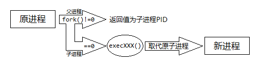

### 从核心开始 1：沙箱、时间限制、内存空间限制

[代码](1/代码)

首先，我们需要考虑项目长期的可维护性。我们比赛时的代码都是在三～五个小时内完成的，不需要考虑以后的事；而这样庞大的工程，是需要维护很长时间的。所以，我们要注意代码的规范，不能像比赛中的那么混乱，并写一些注释或博客，方便以后理解。

按照我上次做Windows下的OJ的经验，我们要完成这样的一个工程，必须先完成核心，然后完成Web；或先完成Web，后完成核心。如果两头同时做，到最后会导致接口不一致。

我选择了先完成核心，然后完成Web。

核心中最重要的无疑是沙箱和时间限制、内存空间限制。

#### 沙箱

测可执行文件时，沙箱很重要。如果没有沙箱，人家交个RootKit或者`while(1)fork();`上来，怎么办？

首先，我们要用到chroot沙箱。

chroot需要root特权。

在Linux系统中，文件系统有个根目录。程序只能访问根目录内的文件。如果我们能对某一个程序设置一个特定的根，不就能限制它的文件访问了吗？

`chroot(".")`就可以解决问题。但是，chroot可以逃逸。[earthquake/chw00t](https://github.com/earthquake/chw00t)&nbsp;&nbsp;我们可以发现，chroot逃逸工具都需要root权限。

于是，我们需要用到setuid和setgid沙箱。

每一个用户都有对应的UID，root的UID为0，具有特权。不同UID间的进程不可以互相通信。一个进程产生的子进程可以继承UID。

同样的，每一个组还有一个GID。

chroot需要root权限。chroot时，我们给了测试进程0号UID和0号GID，产生的被测进程也具有root权限，很危险。

我们先srand为当前系统开机至今的微秒数，然后在测试开始前运行`setgid(rand()); setuid(rand());`（顺序不能颠倒。如果先setuid，setgid时就会没有权限）就可以给被测进程取消特权。

两个沙箱配合，就可以彻底防御住病毒和基于读取测试数据的“自动AC机”。而基于通过错误信息传递测试数据的“自动AC机”，可以在提交时检测该用户是否最近大量提交错误代码。如果是，提示输入验证码。

虽然不能入侵评测机了，但有意卡评测机的大有人在。一行`while(1)fork();`就可以fork出无数子进程，占满CPU和内存。

怎么办？

setrlimit。

前两种沙箱在加上用setrlimit限制fork，禁止写入文件，禁止创建锁。

还是不放心，在加一个ptrace跟踪器沙箱。

上网搜一下，只能搜到i386（32位）的跟踪方法：`orig_eax = ptrace(PTRACE_PEEKUSER, childpid, 4 * ORIG_EAX, NULL);`。

i386和x86_64（64位）是两种CPU架构，因为i386和x86_64的CPU指令长度、寄存器类型不同，`orig_eax = ptrace(PTRACE_PEEKUSER, childpid, 4 * ORIG_EAX, NULL);`在x86_64环境下根本没用，甚至编译报错`ORIG_EAX`没定义。

那么，x86_64的呢？

还要我自己研究。

先让我们来看看`ORIG_EAX`是在那个头文件里。

教给大家一个好方法：

把/usr/include/sys复制一份，然后在副本中新建一个文件夹，数一下所有头文件多少个，把前一半移动到新文件夹里，然后`cat *.h | grep ORIG_EAX`，看有没有输出。如果没有，说明含有定义的头文件被移动进了新文件夹，Ctrl + Z撤销，把另一半删掉，否则删光新文件夹中的文件，然后重复，直到只剩下一个文件，就是我们要的那个文件。

最后只剩下reg.h，对我们有价值的内容如下：

``` C++

#ifdef __x86_64__

/* Index into an array of 8 byte longs returned from ptrace for

   location of the users' stored general purpose registers.  */

......

# define ORIG_RAX 15

......

#else

/* Index into an array of 4 byte integers returned from ptrace for

 * location of the users' stored general purpose registers. */

......

# define ORIG_EAX 11

......

#endif

```

很容易看到，前面是`#ifdef __x86_64__`，即判断当前是否为x86_64，而ORIG_EAX在else里定义，即当前为是否为i386架构——难怪会出现编译错误。

这些EAX、EBX、RAX、RBX等，都是汇编语言里的CPU寄存器。

我从来没接触过汇编语言，晕……

当晚我自学了汇编语言。

在i386中，EAX用来储存系统调用号，在x86_64中是RAX。

把ORIG_EAX换成ORIG_RAX，运行……

一个`-1`出现在我们眼前。

为啥是-1？这个是x86和x86_64的寄存器大小不一样导致的。寄存器大小等于`sizeof (long)`。

reg.h的注释中已经给了我们明显的提示。

再把`4 * ORIG_RAX`换成`8 * ORIG_RAX`，成功！

仿照reg.h，给代码加上预处理if：

```C++

		wait(NULL);

#ifdef __x86_64__

		orig_rax = ptrace(PTRACE_PEEKUSER, childpid, 8 * ORIG_RAX, NULL);

#else

		orig_rax = ptrace(PTRACE_PEEKUSER, childpid, 4 * ORIG_EAX, NULL);

#endif

		printf("The child made a system call %ld\n", orig_rax);

```

这时，不管是x86环境还是x86_64环境，都能正常捕获系统调用。

如果我们发现子进程发出的一种危险的系统调用数量大于另一个运行后输出\0（一定要输出\0，否则在被测程序中正常输出也会被判为RF）然后直接退出的程序的对应的数量，直接`ptrace(PTRACE_KILL, childpid, NULL, NULL);`，然后判RF(Restricted Function)错误。

还有一点，C++的throw很奇怪。所以需要：

``` C++

syscallbasecount[SYS_rt_sigprocmask] = 6;

syscallbasecount[SYS_getpid] = 2;

syscallbasecount[SYS_gettid] = 2;

syscallbasecount[SYS_tgkill] = 2;

syscallbasecount[SYS_rt_sigaction] = 1;

// syscallbasecount为空程序的危险系统调用数量。

```

<br />


有了这四道沙箱，OJ就能不被卡、不被黑了。

编译器也要在沙箱里运行，但是只需要一个chroot沙箱+时间限制+输出文件大小限制，setuid沙箱和ptrace沙箱可以省去。

为什么？

``` C++

#include </dev/zero>      // Linux，让编译器读取随机值

#include <CON>              // Windows，让编译器读取控制台

``` 

能让编译器不断读取字符设备，永远编译下去；`#include </dev/zero>`可以占满内存，使编译机死机；`int bomb[10000000000] = {1};`可以产生体积巨大达40GB的可执行文件；2016版的HUSTOJ可以从`#include "/var/www/JudgeOnline/include/db_info.inc.php"`的编译错误信息中读出管理员的帐号名和密码……

#### 时间限制和内存空间限制

一开始，我以为内存空间限制也可以用setrlimit解决，但是这样会导致把部分MLE判断成RE。因为C++在new失败时会throw。最后，我找到了正确的方法：在ptrace拦截到SYS_brk和SYS_mmap返回时检查子进程的内存空间占用。

但是这样又引起了一个问题：检查内存的时间也被算在了程序时间内。

我们可以定义一个begintime，一个timespent，在wait前获取电脑开机至今的微秒数，储存在begintime，wait结束后`timespent += 电脑开机至今的微秒数 - begintime`，程序结束时timespent就是程序运行的微秒数。

至于时间限制，再`fork()`一下，子进程中`usleep((timelimit + 200) * 2000); waitpid(childpid, NULL, WNOHANG) ? (kill(childpid, SIGKILL)) : (0); return 0;`。

#### 万事具备，只欠运行

眼看着要成功了，最最简单的问题来了。Linux下，怎么运行被测程序？（我第一次搞Linux系统编程）

CreateProcess？WinExec？那是Windows下的！

Linux下，需要fork和exec两个API函数来解决这个问题。

头很晕吧？

创建一个进程，为啥要两个API函数？接口设计的一个指导原则是“完整且最小”，即对外提供的接口必须能够满足任何使用要求，且接口功能无重复、重叠。

Windows的设计能服务所有层次的开发者，而POSIX更具有极客精神。

fork用于把进程复制一份，exec用于让另一个可执行文件替代调用进程。

exec是一个函数家族：

``` C++

int execl(const char *path, const char *arg, ...);

int execlp(const char *file, const char *arg, ...);

int execle(const char *path, const char *arg, ..., char *const envp[]);

int execv(const char *path, char *const argv[]);

int execvp(const char *file, char *const argv[]);

int execve(const char *path, char *const argv[], char *const envp[]);

/* 实际上他们的功能都是差不多的。因为C没有函数重载，但要接受不同的参数，所以要用不同的函数名来区分它们。

exec[l or v][p][e]

e后续：参数带环境变量部分

l后续：命令参数部分必须以"," 相隔，不以NULL开头，最后一个命令参数必须是NULL

v后续：命令参数部分必须是一个不以NULL开头，但以NULL结尾的字符串指针数组的头部指针

p后续：执行文件部分可以不带路径, exec函数会在$PATH中找

*/

```

我们选择execle。execle可以设置环境变量，我们直接在环境变量上放一个NULL，就能解决被测程序读取环境变量的问题。还有，execle是template递归定义的，不用专门构造argv数组。所以，`execle("被测程序文件路径", "", NULL, NULL);`。



一个进程在分叉后所有的变量、虚拟指针（所有没有mmap映射到固定物理地址的指针）指向的地址都会被复制一份。如果父子进程要通信，可以采用mmap映射指针到物理地址，然后通过这个指针指向的地址通信。

在取代原子进程这个过程中，新进程从原子进程继承了PID、rlimit、根目录、UID、PTRACE_TRACEME。

fork后父进程要接收SIGCHLD，否则子进程将成为僵尸进程。wait/waitpid会接收此信号。同时，也可以自己`signal(SIGCHLD, signalhandler_sigchld);`，signalhandler_sigchld为回调函数名。

wait/waitpid还接收子进程被暂停的信号。wait/waitpid可以获取子进程状态。子进程状态的二进制末尾7为为信号值，是子进程死亡的原因；其余部分为子进程返回值。正常返回时，信号值为0；被杀死时，返回值为0。这点和大家写的UNIX shell脚本不一样。大多数shell会在子进程被杀死时用信号值替代返回值，而这里信号值是信号值，返回值是返回值，互不影响。

#### 关于踩坑

一个字，坑！

<br />


我布置好chroot沙箱后发现一直提示找不到文件。我的文件明明摆在这啦！怎么会找不到？

我改成启动静态编译的BusyBox，就能启动。我用BusyBox ls一下，有这个程序。然后./程序名，也找不到文件。

我想起来，BusyBox是静态编译的。这里的找不到文件，不是找不到程序文件，而是找不到运行时所依赖的库文件，例如libstdc++.so.6。编译时加上-static，成功运行。

###### 坑！

加上限制fork的沙箱和setuid沙箱，setuid失败。我去掉限制fork的沙箱，然后setu/gid沙箱就能正常工作。因为setu/gid时需要fork一次，所以要把setu/gid放到setrlimit前。

###### 真坑！

我调试了半天，一直在调waitpid()，还没成功。

我又改成signal捕获子进程退出信号，在捕获到后获取子进程的内存使用情况并记录退出时间。这样有一个好处：直接在父进程中usleep到时间限制，子进程退出后会触发信号，程序自动唤醒，节省时间。

结果程序一直卡在捕获后获取子进程的内存使用情况上。我都快疯了。再到System Monitor中看看……

程序已经结束了……

晕倒……

子进程在父进程收到信号后就会退出，无论是否waitpid。至于网上那些在说回调函数中调用waitpid的人，都是胡说八道的。

我查了Linux Man Page。

A process can change the disposition of a signal using sigaction(2) or signal(2).

然后我查了signal和sigaction的区别。

signal会在收到信号之后设置信号下次将按默认方式处理，然后调用回调函数；sigaction直接调用回调函数，其余的它不管，且它会返回原行为。

我又折腾了sigaction，成功了。从理论上讲，signal也可以成功。

我在回调函数中加上`signal()`，也成功了。

然后，子进程没有退出。

然后，

然后……

但是，

但是……

僵尸进程不能查询内存使用情况。这么多白弄了！

###### 我踩上了大坑了！

后来，我在做ptrace沙箱时发现，在子进程发出SYS_exit_group系统调用时记录退出时间，然后记录内存使用。

<br />


我突然发现我不会判正常退出：进程始终没有发出SYS_exit_group信号。

我输出了一下调用情况，发现SYS_exit_group是一个只有调用，没有返回的系统调用。

我把拦截SYS_exit_group的部分移动到调用里，成功了。

###### 这是最小的一个坑——我只花了20秒就爬出来了。

<br />


做ptrace时，网上的例子竟没一个有RE判断的。

还要自己做。

要判断RE，如果不带ptrace，可以直接WIFSIGNALED。

试了一下，没有用。

我上午睡觉，醒来后上辅导班，5点结束（今天辅导班少一点），晚上写一个小时作业，调试了半个下午 + 半个晚上 + 一个午夜，总共整整9个小时，也不成功。

###### 一路全是坑！

原来，在ptrace跟踪时，只要子进程没有正常退出，信号值永远为127，而真正的信号储存在返回值的位置上。（我发现这一点的过程简直苦不堪言。网上搜不到，man pages里没有。忽然想到二进制，一转换，竟然成功了！）

那么，此时的信号值为`childstatus >> 8`。

我先得到被ptrace暂停的时候子进程状态为1407，二进制为00000101 01111111，右移8位为00000101,对应的十进制为5，即SIGTRAP。我们可以写出RE判断条件：`(childstatus >> 8) != SIGTRAP`，因为如果此时如果正常退出，我们就会拦截到SYS_exit_group信号。如果此时还没拦截到SYS_exit_group，说明RE了。

判断一下，如果信号为SIGKILL，则杀死子进程的为超时控制的那个子进程，判TLE，否则判RE。

#### 后记

为什么我用C++，而不是用更简单的Python？

C++基于底层，运行速度快，精确度高，且C++可以将沙箱和监控整合到一起，不用单独循环查询内存使用等，资源占用少。还有，Python沙箱容易逃逸，但我的沙箱不能逃逸——除非有人能找到Linux Kernel的漏洞。

质量、安全、方便中，你至少要扔掉一个。我扔掉了方便。

###### 2019.07.20~23